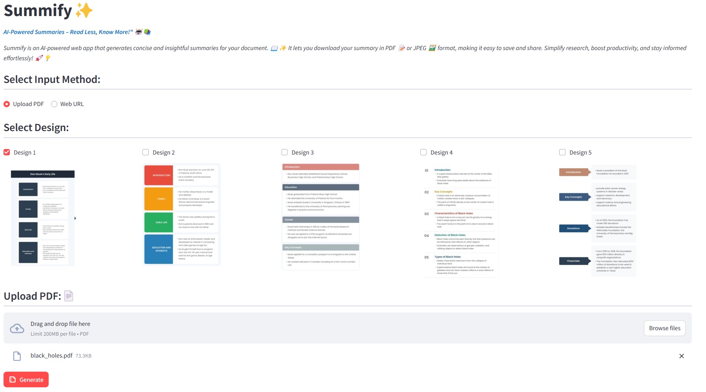
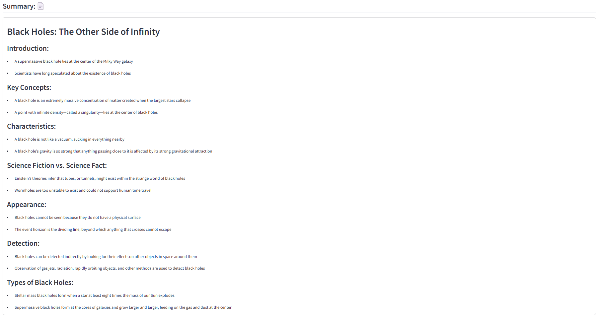
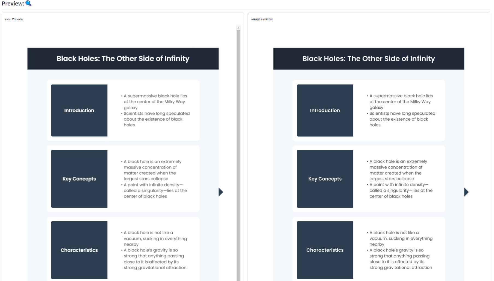
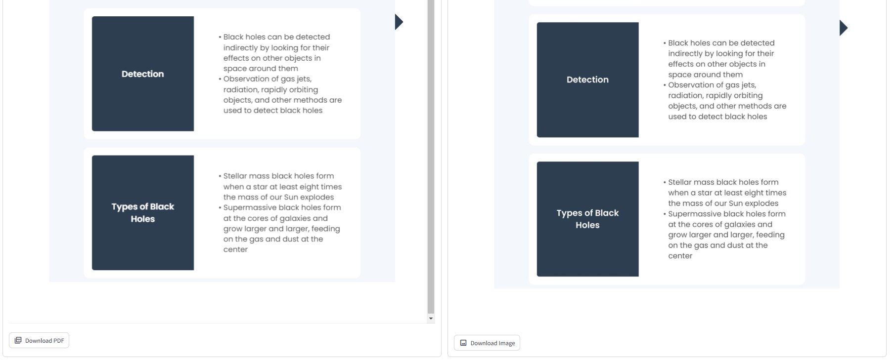
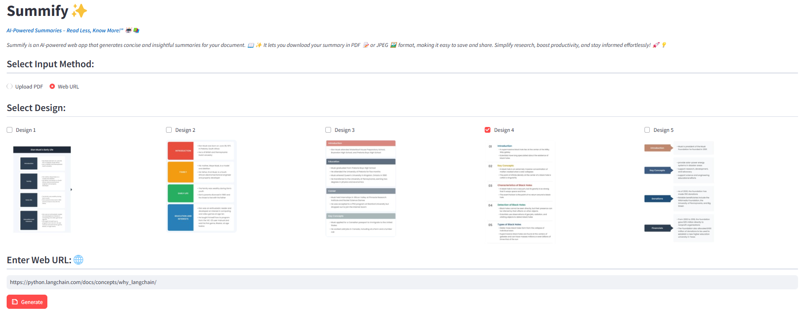
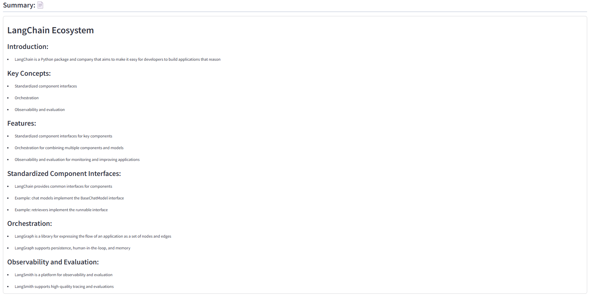
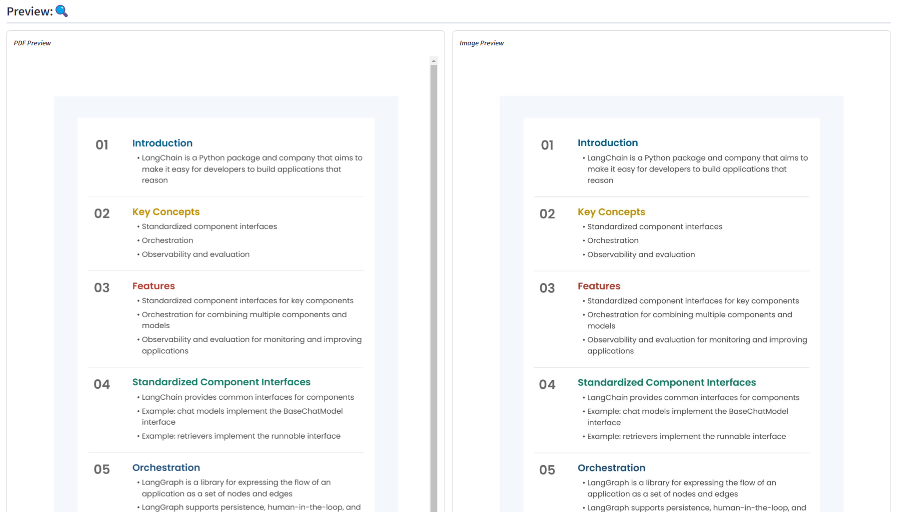
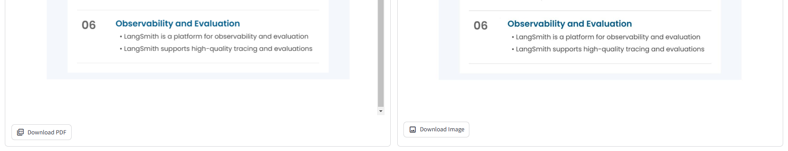

# Summify ✨
AI-Powered Summaries – Read Less, Know More!" 🤖📚

Summify is an AI-powered web app that generates concise and insightful summaries for your document. 📖✨ 
It lets you download your summary in PDF 📝 or JPEG 🖼️ format, making it easy to save and share. Simplify research, 
boost productivity, and stay informed effortlessly! 🚀💡

# Application Link
https://summify-st.streamlit.app/

# Technologies Used
* streamlit -- Front end development
* LangChain -- LLM Orchestration
* Groq -- Chat models
* WeasyPrint -- HTML to PDF Conversion
   
# System Requirements
You must have Python 3.11 or later installed.

# Installation
1. Clone this repository
2. Create a virtual environment
3. Install the necessary python packages:
   `pip install -r requirements.txt`
4. Set `GROQ_API_KEY` in `.streamlit/secrets.toml` file
5. Run the application with following command from terminal:

   `streamlit run main.py`

# Screen Shots

